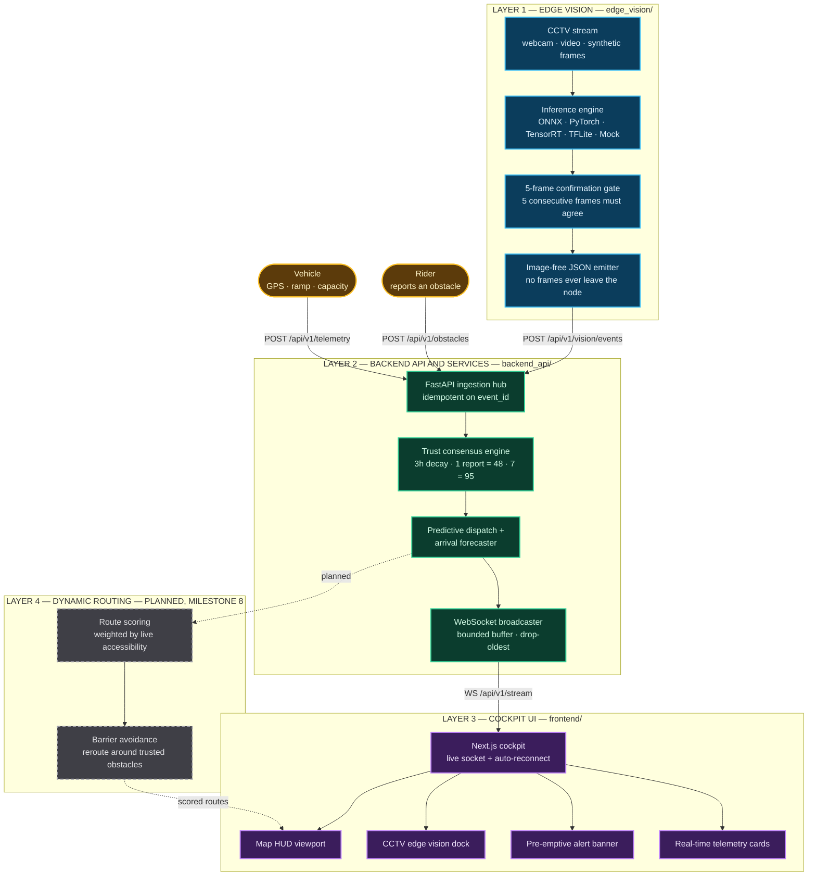

# MonFate

**Accessible transit cockpit for Cyberjaya — SDG 11: Sustainable Cities & Communities**

---

## MonFate at a Glance

A wheelchair user waiting at a Cyberjaya bus stop has no way to tell an
approaching bus that they need the ramp — and no way to know the ramp's landing
zone is blocked by a parked van until they are already there. MonFate closes
that gap by combining **station CCTV that recognises who needs assistance**,
**crowd-sourced obstacle reports scored by a trust engine that forgets stale
claims**, and **live vehicle telemetry that knows which buses actually have a
working ramp**. The result is a cockpit that warns the driver *before* they
arrive, instead of leaving a rider stranded and reporting it afterwards.

---

## Architecture Flow

How a single detection travels from a camera at a bus stop to an alert on the
driver's screen. GitHub renders this diagram natively — click it to pan and zoom.



**Read it in 30 seconds:** a camera sees a wheelchair → the gate waits for 5
agreeing frames so a flicker never dispatches a bus → only a label leaves the
device → the backend scores it, decides which *accessible* bus is inbound, and
broadcasts → the cockpit shows the driver an alert before arrival.

---

## What Each Folder Does

| Folder | In plain English |
|---|---|
| **`edge_vision/`** | The code that would run on a small computer at the bus stop. It watches the camera, decides whether someone needs assistance, and sends a short text message about it — never a picture. |
| **`backend_api/`** | The server in the middle. It receives messages from stops, buses, and riders; works out how much to trust each report; predicts arrivals; and pushes everything live to the screen. |
| **`frontend/`** | The dashboard people actually look at — the map, the alerts, the vehicle list. Built with Next.js. |
| **`docs/`** | Architecture notes, the shared data contracts, and the milestone tracker. Read `PROJECT_STATE.md` before changing any data shape. |
| **`AGENTS.md`** | The rules for how Claude and Codex work together — branch names, PR requirements, who owns what. |
| **`CLAUDE.md`** | Day-to-day cheat sheet: commands, code style, PR review checklist. |

---

## How to Run Locally

You need **Python 3.10+** and **Node 18+**. Nothing else — no camera, no
hardware, no API keys. The backend simulates a fleet driving the Cyberjaya
corridor and fires synthetic CCTV detections at the stops.

### Terminal 1 — Backend

```bash
cd backend_api
pip install -r requirements.txt
SYS_MOCK_DATA=true python -m uvicorn app.main:app --port 8000
```

On Windows PowerShell, set the variable separately:

```powershell
cd backend_api
pip install -r requirements.txt
$env:SYS_MOCK_DATA="true"; python -m uvicorn app.main:app --port 8000
```

Check it worked: open **http://localhost:8000/docs** — you should see the API
explorer.

### Terminal 2 — Frontend

```bash
cd frontend
cp .env.example .env.local
npm install
npm run dev
```

Open **http://localhost:3000**. Within a few seconds you should see the
telemetry link go **Live**, buses moving along the corridor, and dispatch alerts
appearing as the simulated stops report passengers.

> **Start the backend first.** The cockpit still renders without it, but every
> panel will read "Offline" because there is nothing to stream.

### Optional — Run the edge vision pipeline on its own

```bash
python -m edge_vision.run --mock        # synthetic frames, no camera, no model
python -m edge_vision.run --source 0 --preview   # your real webcam
```

---

## Live System Status & Open Gaps

### What works today

| Capability | Status | Where |
|---|---|---|
| Cockpit UI — map HUD, CCTV dock, alert banner, telemetry cards | ✅ Live | `frontend/src/components/` |
| WebSocket telemetry with auto-reconnect and staleness detection | ✅ Live | `frontend/src/lib/useCockpit.ts` |
| Vehicle simulation driving the Cyberjaya corridor | ✅ Live | `backend_api/app/mockgen.py` |
| Mock CV detections raising real dispatch alerts | ✅ Live | `backend_api/app/pipeline.py` |
| Alerts routed **only** to accessible inbound vehicles | ✅ Live | `backend_api/app/services/dispatch.py` |
| Exponential trust decay — stale reports stop rerouting riders | ✅ Live | `backend_api/app/services/trust.py` |
| Obstacle reporting + corroboration, scored server-side | ✅ Live | `backend_api/app/main.py` |
| Arrival + dwell forecasting with fail-closed statuses | ✅ Live | `backend_api/app/services/forecast.py` |
| Idempotent ingest — a retried POST never double-counts | ✅ Live | `backend_api/app/crud.py` |
| Edge pipeline: 4 inference backends, gate, image-free emitter | ✅ Live | `edge_vision/` |

### What's next

| Gap | Why it matters | Milestone |
|---|---|---|
| **Detection head cannot see wheelchairs yet.** The shipped weights were pre-trained for a different task, so the pipeline runs through `MockDetector` cycling the accessibility classes. | Everything downstream is real — gate, emitter, ingest, trust, dispatch, cockpit. Only the model output is synthetic. Needs `finetune.py` plus a labelled mobility-aid dataset. | 7 |
| **Route scoring and barrier avoidance not built.** The `AccessibilityRoute` contract and the spatial maths it needs exist; no path-scoring endpoint does. | This is Layer 4 in the diagram, drawn dashed for a reason. Riders currently see obstacles but are not routed around them. | 8 |
| **Station node is simulated, not embedded.** No firmware / RTOS build yet. | The pipeline runs on a laptop today. | 9 |
| **No WCAG audit yet.** Keyboard paths, focus states, and `aria-live` regions are built in but unverified against the spec. | This is an accessibility product; the bar is higher than usual. | 10 |

---

## Deeper Reference

<details>
<summary><strong>Layer 1 — Edge vision (<code>edge_vision/</code>)</strong></summary>

Backend-agnostic pipeline: **source → inference → confirmation gate →
image-free emitter**.

- **Four interchangeable backends** (`inference/`): PyTorch, ONNX Runtime,
  TFLite, TensorRT, plus a dependency-free `mock`. An automatic fallback chain
  walks TensorRT → ONNX → PyTorch and GPU → CPU, so a missing GPU never aborts a run.
- **`ConsecutiveDetectionGate`** — emits only after N consecutive frames agree
  on the same accepted class with exactly one object in view. Set to **5** here:
  a false dispatch wastes a bus, and a waiting passenger is a persistent signal,
  not a transient one.
- **Image-free `EventEmitter`** — a validated, schema-versioned metadata record
  per accepted detection, over stdout / HTTP / MQTT. **No frames ever leave the
  device.** This is load-bearing, not incidental: the subjects are disabled
  passengers at public transit stops.
- **Detection targets** (`classes.yaml`): `wheelchair`, `stroller`,
  `mobility_aid`, `ambulant`, `other`. Only the first three are dispatchable —
  an unassisted passenger is not a boarding request.

</details>

<details>
<summary><strong>Layer 2 — Backend API (<code>backend_api/</code>)</strong></summary>

| Endpoint | Purpose |
|---|---|
| `POST /api/v1/vision/events` | Station CCTV detection ingest (idempotent on `event_id`) |
| `POST /api/v1/telemetry` | Vehicle position / ramp / capacity update |
| `POST /api/v1/obstacles` | Rider obstacle report (trust scored server-side) |
| `POST /api/v1/obstacles/{id}/confirm` | Corroborate a report, raising its trust |
| `GET /api/v1/obstacles` · `/vehicles` · `/stops` | Query |
| `GET /api/v1/stops/{id}/forecast` | Arrival + dwell forecast |
| `WS /api/v1/stream` | Live fan-out: `vehicle`, `obstacle`, `vision`, `alert`, `lag`, `pong` |

- **Bounded WebSocket fan-out** (`stream.py`) — per-client `deque` with
  drop-oldest and a `lag` frame, so one slow cockpit can't grow memory
  unboundedly or silently show stale positions.
- **Device auth** — `X-API-Key` constant-time compared, optional HMAC-SHA256
  body signature behind `SYS_REQUIRE_HMAC`.
- **Standalone simulation** (`SYS_MOCK_DATA=true`) drives the fleet and fires
  synthetic detections through the *same* code path a real node takes, so there
  is no second path to drift.

</details>

<details>
<summary><strong>Layer 2b — Predictive services (<code>backend_api/app/services/</code>)</strong></summary>

| Module | What it does |
|---|---|
| `trust.py` | Weighted signal sources, saturating corroboration curve, exponential recency decay. 1 report → 48, 3 → 72, 7 → 95; the same 7 decay to 56 after three hours, dropping below the actionable threshold of 70. Approaches certainty asymptotically and never reaches it, so "94%" means something. |
| `spatial.py` | Haversine distance, initial bearing, ETA from speed with a congestion floor, and point-to-corridor proximity for approach-path checks. |
| `forecast.py` | Arrival + dwell prediction with fail-closed statuses (`ok` / `cold_start` / `stale` / `unavailable`) — a blank ETA can't tell a rider whether the bus is late or the service is broken. |
| `dispatch.py` | Matches a detection to the nearest **accessible** inbound vehicle within the ETA window. A bus with no working ramp is never alerted, since that would report a "handled" boarding that cannot happen. |

</details>

<details>
<summary><strong>Layer 3 — Cockpit (<code>frontend/</code>)</strong></summary>

Next.js 16 + React 19 + Tailwind v4, OKLCH design tokens on a glassmorphism
surface. Live over one WebSocket with exponential reconnect backoff.

| Feature | Where |
|---|---|
| **Map HUD viewport** — WGS84 auto-fit projection, route corridor, heading-aware vehicle markers, obstacle opacity scaled by trust score | `components/MapHud.tsx` |
| **CCTV Edge Vision dock** — latest detection, confidence, inference time, p50 latency, rolling log | `components/CctvEdgeDock.tsx` |
| **Telemetry strips** — link state + ping, accessible-fleet ratio, active obstacles above trust threshold, stops monitored | `components/TelemetryStrip.tsx` |
| **Pre-emptive dispatch alerts** — severity-coded, `aria-live` announced, dismissible | `components/DispatchAlertBanner.tsx` |
| **Accessibility profile toggles** | `components/AccessibilityFilterBar.tsx` |
| **Obstacle reporting + trust display** | `components/ObstacleReportModal.tsx`, `TrustBadge.tsx` |

No map tile provider or API key required — the HUD projects coordinates itself.

</details>

---

## Milestones

Legend: ✅ done · ⬜ not started

| # | Milestone | Layer | Owner | Status |
|---|---|---|---|---|
| 1 | Repo scaffolding, dual-agent guardrails, contracts | Docs | Claude | ✅ |
| 2 | Frontend HUD: map, filters, obstacle modal, transit card | UI | Claude | ✅ |
| 3 | Edge vision pipeline ported + retargeted to accessibility classes | Edge | Claude | ✅ |
| 4 | Backend telemetry: ingest, WebSocket stream, transit simulation | Backend | Claude | ✅ |
| 5 | Trust consensus, spatial, forecasting, dispatch services | ML | Claude | ✅ |
| 6 | Cockpit wired to live backend | UI | Claude | ✅ |
| 7 | Fine-tuned detection head on real mobility-aid data | Edge | Codex | ⬜ |
| 8 | Route scoring endpoint + rendered accessible routes | Backend + UI | Both | ⬜ |
| 9 | Firmware / RTOS station node beyond the simulator | Edge | Codex | ⬜ |
| 10 | End-to-end demo polish + WCAG audit | All | Both | ⬜ |

### Changelog

**2026-09-05 — Team README + Cyberjaya corridor**
- Added the interactive Mermaid architecture diagram and a beginner-friendly
  team guide.
- Moved the demo stop registry to Cyberjaya coordinates (Tamarind Square,
  Shaftsbury Square, Cyberjaya Transport Terminal, MMU Cyberjaya) so the code
  matches the stated mission.

**2026-09-05 — Full-stack migration**
- Ported the edge vision pipeline into `edge_vision/`; retargeted detection
  classes, raised the confirmation gate to 5 frames, excluded `ambulant` from
  dispatch.
- Built the backend telemetry engine: idempotent ingest, bounded WebSocket
  fan-out, corridor simulation.
- Added the predictive services layer: trust consensus with recency decay,
  spatial primitives, fail-closed forecasting, dispatch engine.
- Rebuilt the frontend as a live cockpit.

**2026-09-05 — Foundation**
- Repo scaffolding, `AGENTS.md` dual-agent guardrails, `CLAUDE.md`, contracts
  in `backend_api/app/schemas/`, initial Next.js accessibility HUD.

---

## Contributing

Read [AGENTS.md](AGENTS.md) first. In short: no direct pushes to `main`, every
change goes through a PR, and shared data shapes live in
`backend_api/app/schemas/` mirrored in `frontend/src/types/monfate.ts` —
changing one without the other breaks ingest.
